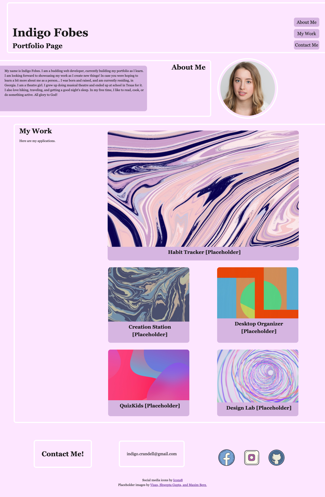

# my-pro-portfolio
GT Challenge 2 – Create my own professional portfolio

## Description
The purpose of this project was to create a functional portfolio for my work as a web developer. The final product is something that I will use (and likely upgrade) as I build my portfolio of applications.

## Acceptance Criteria
1. The portfolio includes my name, a recent photo, and links to sections about me, my work, and how to contact me.
2. The navigation links take the user to each corresponding section.
3. The section with my work includes titled images of my applications. 
4. The first application is larger than the others.
5. When the user clicks on the images of the applications, they are taken to the deployed application.
6. The page is adaptable to the user's viewport.

## Image of Page

## Deployed Application
Click [here](https://indigofobes.github.io/my-pro-portfolio/develop) for the live URL.

Click [here](https://github.com/IndigoFobes/my-pro-portfolio.git) for my GitHub repository.